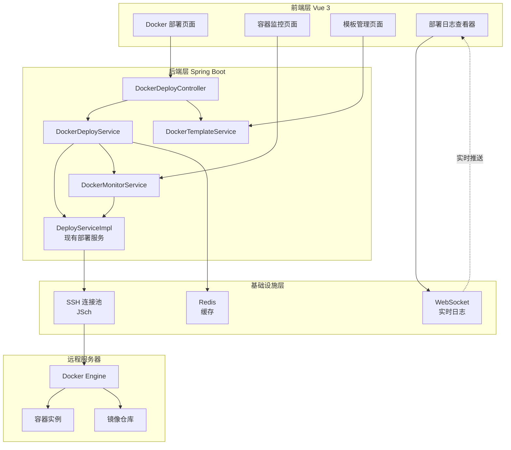
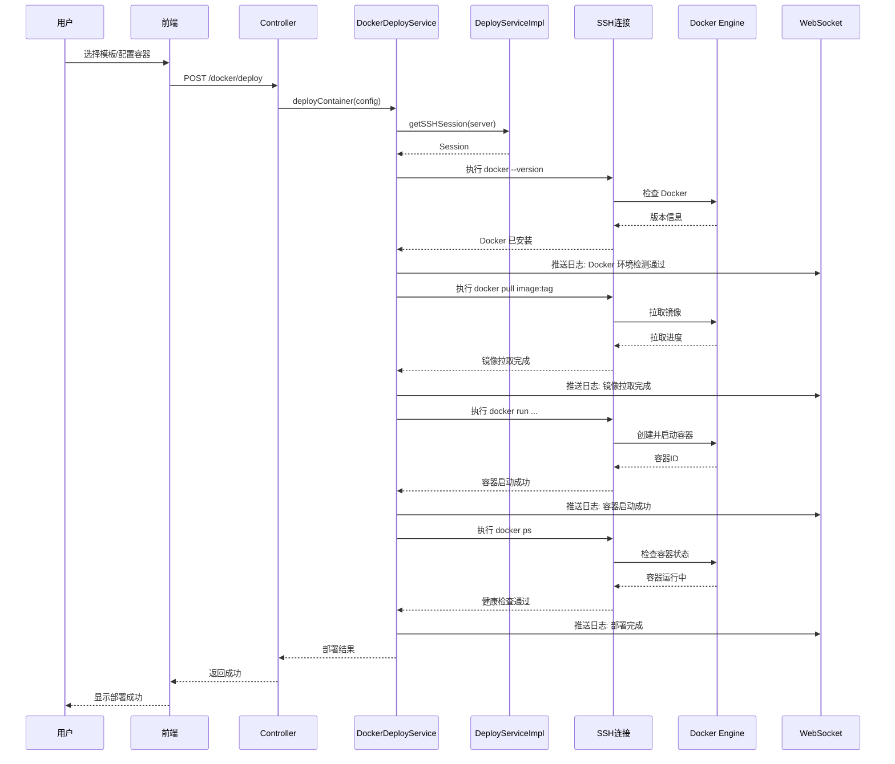

# 架构设计

### 系统架构图

```mermaid
graph TB
    subgraph "前端层 Vue 3"
        A[Docker 部署页面]
        B[容器监控页面]
        C[模板管理页面]
        D[部署日志查看器]
    end
    
    subgraph "后端层 Spring Boot"
        E[DockerDeployController]
        F[DockerDeployService]
        G[DockerTemplateService]
        H[DockerMonitorService]
        I[DeployServiceImpl<br/>现有部署服务]
    end
    
    subgraph "基础设施层"
        J[SSH 连接池<br/>JSch]
        K[WebSocket<br/>实时日志]
        L[Redis<br/>缓存]
    end
    
    subgraph "远程服务器"
        M[Docker Engine]
        N[容器实例]
        O[镜像仓库]
    end
    
    A --> E
    B --> H
    C --> G
    D --> K
    E --> F
    E --> G
    F --> I
    F --> H
    H --> I
    I --> J
    F --> L
    J --> M
    M --> N
    M --> O
    K -.实时推送.-> D
```

### 部署流程序列图

```mermaid
sequenceDiagram
    participant U as 用户
    participant F as 前端
    participant C as Controller
    participant S as DockerDeployService
    participant D as DeployServiceImpl
    participant SSH as SSH连接
    participant Docker as Docker Engine
    participant WS as WebSocket
    
    U->>F: 选择模板/配置容器
    F->>C: POST /docker/deploy
    C->>S: deployContainer(config)
    S->>D: getSSHSession(server)
    D-->>S: Session
    
    S->>SSH: 执行 docker --version
    SSH->>Docker: 检查 Docker
    Docker-->>SSH: 版本信息
    SSH-->>S: Docker 已安装
    S->>WS: 推送日志: Docker 环境检测通过
    
    S->>SSH: 执行 docker pull image:tag
    SSH->>Docker: 拉取镜像
    Docker-->>SSH: 拉取进度
    SSH-->>S: 镜像拉取完成
    S->>WS: 推送日志: 镜像拉取完成
    
    S->>SSH: 执行 docker run ...
    SSH->>Docker: 创建并启动容器
    Docker-->>SSH: 容器ID
    SSH-->>S: 容器启动成功
    S->>WS: 推送日志: 容器启动成功
    
    S->>SSH: 执行 docker ps
    SSH->>Docker: 检查容器状态
    Docker-->>SSH: 容器运行中
    SSH-->>S: 健康检查通过
    S->>WS: 推送日志: 部署完成
    
    S-->>C: 部署结果
    C-->>F: 返回成功
    F-->>U: 显示部署成功
```

